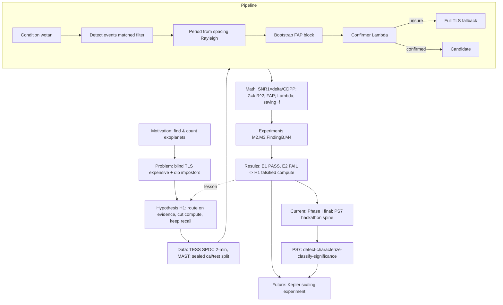

# Deliverable 7 — TRINETRA-X Knowledge Map
### How motivation → problem → hypothesis → data → pipeline → math → experiments → results → status → future all connect.

## 1. The single causal spine (read top to bottom)
```
MOTIVATION  "Are we alone? Count Earth-like worlds."
   │  (transits dominate discovery, but blind search is expensive)
   ▼
PROBLEM     Full TLS tests every star × every period → wasteful; and dips have impostors.
   │
   ▼
HYPOTHESIS  H1: evidence-first routing cuts compute vs TLS WITHOUT losing recall.
   │        (formalized: saving≈f, recall loss≈f(1−r_seed·g); valid iff f(1−r_seed·g)≤0.02)
   ▼
DATA        TESS SPOC 2-min light curves (MAST); M0 manifest, leakage-safe cal/test split (sealed).
   │
   ▼
PIPELINE    Condition → Detect events → Period-from-spacing → Bootstrap FAP → Λ confirmer → (TLS fallback)
   │            │           │                │                    │              │
   ▼            ▼           ▼                ▼                    ▼              ▼
MATH      wotan/      matched      Rayleigh Z(P)=     block bootstrap     likelihood     §8 cost
          σ=1.4826MAD  filter       k·R̄²            FAP=Σ1[T^b≥T_obs]   ratio Λ        model
          (§2)        SNR₁=δ/CDPP   (§4)              /B  (§9)            (§6)           ΔR=−f(1−r_seed g)
   │
   ▼
EXPERIMENTS  M2 η-preservation · M3 calibration+null cleaning · Finding A/B · confirmer ROC ·
             Lever-1b equivalence (failed) · M4 dress rehearsal · M4 sealed TEST (the one read)
   │
   ▼
RESULTS     E1 recall PASS (−0.48pp; real TOIs Arm B=Arm A=86.7%) · E2 compute FAIL (24.4%<30%, ρ_d 14.4%)
   │        → H1 FALSIFIED (compute branch) = successful negative; recall principle supported
   ▼
CURRENT     Phase I sealed/final (no v4). Active = BAH 2026 PS7 hackathon (extends validated spine):
            detect→characterize(trapezoid U/V)→classify(4-class)→significance; validated on 12 known objs.
   │
   ▼
FUTURE      Kepler scaling experiment (fold k events vs TLS N points → advantage grows with baseline);
            round-2 build: robust period recovery, centroid/blend features, CNN, full report.
```

## 2. Mermaid concept map (paste into any mermaid renderer / Obsidian)


## 3. Cross-links (the "why each connects to each")
| From | To | The link (one line) |
|---|---|---|
| Motivation | Problem | Transits win discovery, but searching is the bottleneck. |
| Problem | Hypothesis | If most stars are empty, route cheaply first. |
| Hypothesis | Math §8 | The bet is literally one inequality: f(1−r_seed·g) ≤ 0.02. |
| Data | Experiments | A sealed, leak-free split makes the one test read trustworthy. |
| Pipeline | Math | Each module = one equation (detect→SNR₁, period→Z, FAP→bootstrap, confirm→Λ). |
| Math §3b | Results | White-noise FP assumption → red noise → why FAP overhead (ρ_d) is large → E2 fails. |
| Finding B | v3/Confirmer | TLS SDE grid-normalization broke "same engine" → Λ at common FAR. |
| Results E1 | Current | Recall held → the spine is trustworthy → reuse it for the hackathon. |
| Results E2 | Future | Compute failed on short baseline → Kepler scaling is the principled next test. |
| Math §8.3a | Future | π⋆=ρ_d/f_p says savings need scale → Kepler's long baseline raises f. |
| Hackathon | Math §6 | The committee's U/V = our trapezoid shape-fit feeding the Λ/classifier. |

## 4. The "five hubs" to memorize (everything hangs off these)
1. **δ = (Rₚ/R⋆)²** — depth↔size (links data, characterization, classification).
2. **SNR₁ = δ/CDPP** — detectability (links detector, routing fraction f, bimodality §7).
3. **FAP via block bootstrap** — honesty/calibration (links significance, the costly ρ_d, E2 failure).
4. **Λ confirmer at common FAR** — physics is the judge (links Finding B, v3, classification).
5. **saving ≈ f, ΔR = −f(1−r_seed·g)** — the whole bet (links hypothesis, results, future).

## 5. Visual build suggestion (for the slide)
- Render Section 1 as a **vertical flow** with the pipeline as a horizontal sub-band.
- Color: blue = data/pipeline, green = math, amber = experiments, red = results, purple = future.
- Put the **five hubs** as a side panel of "anchor equations."
- Use your existing `deck/figs/arch_diagram.png` for the pipeline node and `prototype/figs/{characterization,validation_known}.png` for the results node.
